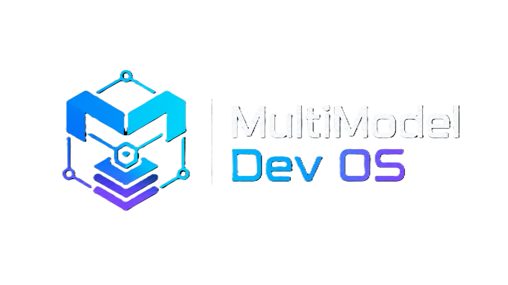

# MultiModel Dev OS

<p align="center">
  
</p>

<p align="center">
  <b>One workspace config. Every AI coding tool. Zero lock-in.</b><br>
  <sub>Stop copy-pasting AI rules between Cursor, Claude, Gemini, Codex, and VS Code. Start shipping.</sub>
</p>

<p align="center">
  <a href="https://www.npmjs.com/package/multimodel-dev-os"></a>
  <a href="https://www.npmjs.com/package/multimodel-dev-os"></a>
  <a href="https://github.com/rizvee/multimodel-dev-os/blob/main/LICENSE"></a>
  <a href="https://github.com/rizvee/multimodel-dev-os/releases"></a>
  <a href="https://github.com/rizvee/multimodel-dev-os/actions"></a>
  <a href="https://github.com/rizvee/multimodel-dev-os/blob/main/CONTRIBUTING.md"></a>
</p>

---

## The Problem

You use **Cursor** for autocomplete, **Claude Code** for terminal ops, **Gemini** for deep audits. Every tool switch loses your context. Every `.cursorrules` / `CLAUDE.md` / `.vscode/settings.json` change drifts out of sync with the others. Prompts bloat, tokens waste, onboarding breaks.

## The Fix: 30 Seconds

```bash
npx multimodel-dev-os@latest init
```

Your workspace now has a **single source of truth** that every AI coding tool reads automatically — no config duplication, no context loss, no vendor lock-in.

> Already have a project? Onboard it safely:
> ```bash
> npx multimodel-dev-os@latest onboard analyze
> ```

---

## Packages

The primary public package is published on npm:

```bash
npm install -g multimodel-dev-os
```

An optional GitHub Packages mirror is prepared under the scoped name `@rizvee/multimodel-dev-os`. It uses `https://npm.pkg.github.com` and is available only after the maintainer runs the manual GitHub Packages workflow.

The root npm package name remains `multimodel-dev-os`.

---

## Key Features

| | Feature | What It Does |
|:---|:---|:---|
| 🔄 | **Universal Adapter Sync** | Write rules once → auto-syncs to `.cursorrules`, `CLAUDE.md`, `.vscode/`, `.gemini/`, and more |
| ⚡ | **Caveman Mode** | Slash prompt token overhead by **~79%** for tight API budgets |
| 🧠 | **Intelligence Engine** | Hash-compressed memory, feedback learning, self-improvement proposals with HITL safety gates |
| 📁 | **Repo Onboarding** | Analyze existing projects, recommend templates, and bootstrap configs without breaking anything |
| 🔧 | **Zero Dependencies** | Pure Node.js CLI — no runtime, no build step, no package manager lock-in |
| 🛡️ | **300+ Quality Gates** | Built-in `validate`, `doctor`, `verify`, and Skill OS registry checks with strict structural assertions |

---

## Supported Tools & Agents

| Tool / Agent | Adapter File | Status |
|:---|:---|:---|
| **Codex** (OpenAI) | `adapters/codex/AGENTS.md` | ✅ Full support |
| **Antigravity** (Google DeepMind) | `.gemini/settings.json` | ✅ Full support |
| **Cursor** | `.cursorrules` | ✅ Full support |
| **Claude Code** (Anthropic) | `CLAUDE.md` | ✅ Full support |
| **Gemini** (Google) | `GEMINI.md` | ✅ Full support |
| **VS Code** (Copilot) | `.vscode/settings.json` | ✅ Full support |
| **Cline / Continue / Roo Code** | Via adapter registry | 🔌 Adapter-ready |
| **Aider / Windsurf** | Via adapter registry | 🔌 Adapter-ready |
| **MCP Tools** (gcloud, Chrome DevTools) | Via tool registry | 🔌 Registry-ready |

> **Zero lock-in.** Switch tools freely — your context, rules, and memory travel with you.

---

## How It Works

```
┌─────────────────────────────────────────────────────────────┐
│  LAYER 1: Central Root Contracts (Single Source of Truth)   │
│  AGENTS.md  •  MEMORY.md  •  TASKS.md  •  RUNBOOK.md      │
└─────────────────────────┬───────────────────────────────────┘
                          │
┌─────────────────────────▼───────────────────────────────────┐
│  LAYER 2: Configuration & Intelligence (.ai/)                │
│  context/  agents/  skills/  prompts/  checks/  session/    │
└─────────────────────────┬───────────────────────────────────┘
                          │
┌─────────────────────────▼───────────────────────────────────┐
│  LAYER 3: Engine Workflows & Safety Gates                   │
│  onboard analyze  •  adapter sync  •  improve apply         │
└─────────────────────────┬───────────────────────────────────┘
                          │
┌─────────────────────────▼───────────────────────────────────┐
│  LAYER 4: Tool & IDE Adapters                               │
│  .cursorrules  •  CLAUDE.md  •  .vscode/  •  .gemini/      │
└─────────────────────────────────────────────────────────────┘
```

---

## Essential Commands

```bash
# Initialize & Onboard
npx multimodel-dev-os@latest init --template nextjs-saas
npx multimodel-dev-os@latest onboard analyze

# Scan, Status & Memory
npx multimodel-dev-os@latest scan
npx multimodel-dev-os@latest status
npx multimodel-dev-os@latest memory build

# Sync IDE Adapters
npx multimodel-dev-os@latest adapter sync all --approved

# Run Workflows & Handoffs
npx multimodel-dev-os@latest workflow run repo-health
npx multimodel-dev-os@latest handoff build

# Inspect Skill OS registries (read-only)
npx multimodel-dev-os@latest skill-os status
npx multimodel-dev-os@latest skill-os validate
npx multimodel-dev-os@latest skill-os list skills
npx multimodel-dev-os@latest skill-os list prompts
npx multimodel-dev-os@latest workflow show release-check
npx multimodel-dev-os@latest workflow show operator-weekly-review
```

📖 **[Full CLI Reference →](https://rizvee.github.io/multimodel-dev-os/CLI)**

---

## Why Not Just a Manual AGENTS.md?

| Capability | Manual Rules File | MultiModel Dev OS |
|:---|:---|:---|
| **Tool Sync** | Manual copy-paste across tools | ✅ Automated dynamic adapters |
| **Context Budgets** | Bloats prompts, wastes tokens | ✅ Caveman Mode cuts **~79%** overhead |
| **Standards** | Easy to drift and corrupt | ✅ CLI `validate` + `doctor` + 300+ check `verify` |
| **Templates** | Start from scratch | ✅ 6 production-ready real-world templates |
| **Model Registry** | Hardcoded model names | ✅ Dynamic capability-scored routing presets |
| **Self-Improvement** | None | ✅ Feedback → Proposals → Apply with safety gates |
| **Onboarding** | Manual setup every time | ✅ `onboard analyze` bootstraps existing repos |

---

## What's New in v4.0

- 🧩 **Modular CLI Architecture** — CLI main routing plus registry and inspection handlers are decomposed into focused internal modules while preserving public commands.
- 🔬 **Verification Engine Decomposed** — `scripts/verify/` is now a modular engine with isolated, independently testable sub-modules.
- 🛡️ **Registry Trust Hardening** — Trust store, remote key workflows, signing, and provenance checks are production-hardened for registry safety.
- 🧪 **Handler-Level Test Coverage** — Focused unit coverage protects decomposed command handlers, registry trust behavior, and package hygiene.

Patch note: v4.0.1 updates npm package-page documentation after the v4.0.0 publication. It does not change runtime behavior or CLI behavior.

**[Full Changelog →](CHANGELOG.md)**

---

## Skill OS Foundation

Skill OS adds a structured, validation-only metadata layer for reusable prompts, skills, permission classes, advisory guardrails, workflow references, and draft-only business operator templates.

Current v4.1 scope on `main` is declarative and local-only:

- RACE+ prompt templates
- Skill registry metadata
- Tool permission metadata
- Advisory guardrail metadata
- Workflow `skill_os` references
- Read-only `skill-os` CLI inspection
- Draft-only business operator templates

Skill OS metadata does not execute automation, enforce permissions at runtime, call external tools, send messages, publish content, or change workflow behavior.

Start here:
**[Skill OS CLI](docs/skill-os-cli.md)** ·
**[Structured Prompts](docs/structured-prompts.md)** ·
**[Skill Registry](docs/skill-registry.md)** ·
**[Tool Permissions](docs/tool-permissions.md)** ·
**[Hooks and Guardrails](docs/hooks-and-guardrails.md)** ·
**[Business Operator Layer](docs/business-operator-layer.md)** ·
**[Migration Guide](docs/skill-os-migration-guide.md)** ·
**[Adoption Checklist](docs/skill-os-adoption-checklist.md)** ·
**[Authoring Reference](docs/skill-os-authoring-reference.md)**

---

## Roadmap

| Version | Focus | Status |
|:---|:---|:---|
| **v2.0.0** | Template Galaxy, Model Registry, Stable Protocol | ✅ Released |
| **v2.2.0** | Codebase Scanner & Hash-Compressed Memory Engine | ✅ Released |
| **v2.3.0** | Feedback Learning & Proposal Engine | ✅ Released |
| **v2.4.0** | Approved Proposal Application Engine | ✅ Released |
| **v2.5.0** | Repository Intelligence Command Center | ✅ Released |
| **v2.6.0** | Real-Repo Onboarding & Adapter Sync | ✅ Released |
| **v2.7.0** | Website, Demo & Distribution System | ✅ Released |
| **v2.8.0 / v2.8.1** | Interactive TUI Dashboard & Plugin Hooks | ✅ Released |
| **v2.9.0** | Local Workflow Marketplace & Plugin Catalog | ✅ Released |
| **v3.0.0** | Trusted Remote Catalog & Registry Governance Layer | ✅ Released |
| **v3.0.1** | Registry UX & Policy Safety Patch | ✅ Released |
| **v3.0.2** | Registry Sync Security Hotfix | ✅ Released |
| **v3.1.0** | Modular Source Layout + Formal Unit Tests | ✅ Released |
| **v3.2.0** | Stable Modular Build + Package Governance | ✅ Released |
| **v3.5.0** | Trusted Registry Signing + Provenance Foundation | ✅ Released |
| **v4.0.0** | Modular CLI, verification engine, registry trust, handler tests, docs/DX hardening | ✅ Released |

**[Full Roadmap →](https://rizvee.github.io/multimodel-dev-os/v3-roadmap)**

Future roadmap:
**[Release state](docs/release-state.md)** ·
**[AI OS roadmap](docs/future-ai-os-roadmap.md)** ·
**[v4.1 Skill OS plan](docs/v4.1-skill-os-foundation-plan.md)** ·
**[Skill OS CLI](docs/skill-os-cli.md)** ·
**[Hooks and Guardrails](docs/hooks-and-guardrails.md)** ·
**[Business Operator Layer](docs/business-operator-layer.md)** ·
**[Skill OS Migration Guide](docs/skill-os-migration-guide.md)**

---

## Documentation & Resources

| Resource | Link |
|:---|:---|
| 📖 Documentation Portal | **[rizvee.github.io/multimodel-dev-os](https://rizvee.github.io/multimodel-dev-os/)** |
| 🐙 GitHub Repository | **[github.com/rizvee/multimodel-dev-os](https://github.com/rizvee/multimodel-dev-os)** |
| 📦 NPM Registry | **[npmjs.com/package/multimodel-dev-os](https://www.npmjs.com/package/multimodel-dev-os)** |
| 🤖 AI Discoverability | **[llms.txt](https://rizvee.github.io/multimodel-dev-os/llms.txt)** |
| 🚀 Quick Start | **[Quickstart Guide](https://rizvee.github.io/multimodel-dev-os/quickstart)** |
| 🏗️ Architecture | **[Architecture Deep Dive](https://rizvee.github.io/multimodel-dev-os/architecture)** |
| ⚔️ Comparison | **[vs Alternatives](https://rizvee.github.io/multimodel-dev-os/comparison)** |
| 🛡️ Stable Protocol | **[Protocol Specification](https://rizvee.github.io/multimodel-dev-os/stable-protocol)** |

---

## Contributing & Community

We welcome contributions! Propose new adapters, request templates, improve docs, or report issues.

- 📖 **[Contributing Guidelines](CONTRIBUTING.md)**
- 🐛 **[Report a Bug](https://github.com/rizvee/multimodel-dev-os/issues/new)**
- 💡 **[Request a Feature](https://github.com/rizvee/multimodel-dev-os/issues/new)**
- ⭐ **[Star us on GitHub](https://github.com/rizvee/multimodel-dev-os)** — it helps others discover this project

---

## License

MIT License. Copyright (c) 2026-present MultiModel Dev OS team.
