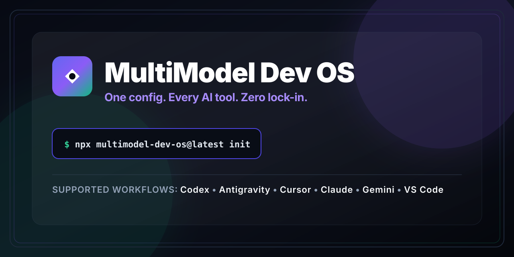
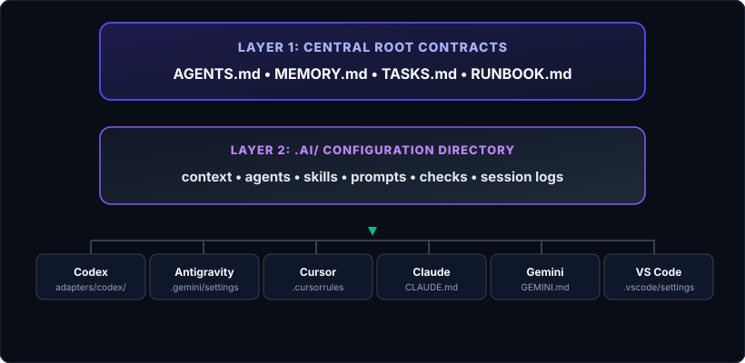
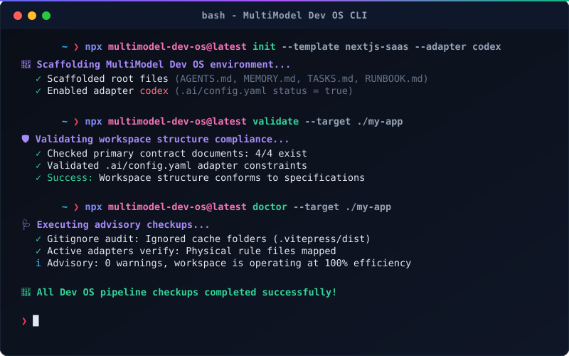
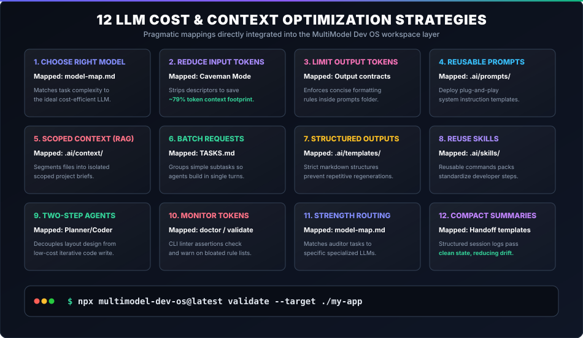
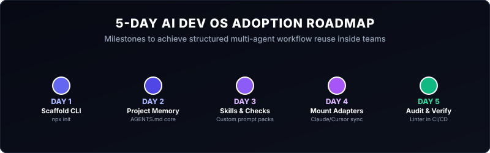

# MultiModel Dev OS

<p align="center">
  
</p>

<p align="center">
  <b>One portable AI Dev OS for multimodel coding workflows.</b>
</p>

<p align="center">
  <a href="https://www.npmjs.com/package/multimodel-dev-os"></a>
  <a href="https://www.npmjs.com/package/multimodel-dev-os"></a>
  <a href="https://github.com/rizvee/multimodel-dev-os/blob/main/LICENSE"></a>
  <a href="https://github.com/rizvee/multimodel-dev-os/releases"></a>
  <a href="https://github.com/rizvee/multimodel-dev-os/actions"></a>
  <a href="https://github.com/rizvee/multimodel-dev-os/blob/main/CONTRIBUTING.md"></a>
</p>

---

## One portable AI Dev OS for Codex, Antigravity, Cursor, Claude, Gemini, VS Code, and multimodel coding workflows.

> [!IMPORTANT]
> **NPM publishing is paused until v2.0.0.** 
> * For the last stable npm-published version (`v1.1.0`), use: `npx multimodel-dev-os@latest init`
> * For unreleased `v1.2.0` features (Model registry, Adapter registry, Android Expo template, new subcommands), clone the source repository and execute commands locally using `node bin/multimodel-dev-os.js`.

Initialize a stable workspace instantly:

```bash
npx multimodel-dev-os@latest init
```

---

<p align="center">
  
</p>

---

## Why This Exists

AI pair programmers are lightning-fast, but switching between them introduces context fragmentation:
1. **Context Loss:** You use **Cursor** for autocomplete, **Claude Code** for command execution, and **Gemini/Antigravity** for deep audits. Every switch forces you to rebuild context.
2. **Instruction Drift:** Different tools look for different config files (`.cursorrules`, `CLAUDE.md`, `.vscode/settings.json`, `.gemini/settings.json`). Modifying style rules or build parameters in one place leaves the others outdated.

`multimodel-dev-os` solves this by establishing a single source of truth in your repository: four root contracts (`AGENTS.md`, `MEMORY.md`, `TASKS.md`, `RUNBOOK.md`) and a `.ai/` directory that bridges them to all major tools dynamically.

---

## What You Get

A standard installation scaffolds a lightweight, zero-runtime-dependency workspace hierarchy:

```
┌────────────────────────────────────────────────────────┐
│ LAYER 1: Root Contracts (Single Source of Truth)       │
│ AGENTS.md • MEMORY.md • TASKS.md • RUNBOOK.md          │
└──────────────────────────┬─────────────────────────────┘
                           │ Centralizes project context
┌──────────────────────────▼─────────────────────────────┐
│ LAYER 2: Configuration & Modules (.ai/)                │
│ context/ • agents/ • skills/ • prompts/ • checks/      │
└──────────────────────────┬─────────────────────────────┘
                           │ Routes files dynamically
┌──────────────────────────▼─────────────────────────────┐
│ LAYER 3: Tool & IDE Adapters                           │
│ .cursorrules • CLAUDE.md • .vscode/ • .gemini/        │
└────────────────────────────────────────────────────────┘
```

<p align="center">
  
</p>

---

## Supported Tools

| Tool / Agent | Target Adapter File | Setup Instructions | Behavior Setup |
| :--- | :--- | :--- | :--- |
| **Codex** | `adapters/codex/AGENTS.md` | `adapters/codex/setup.md` | Automated code scaffolding |
| **Antigravity** | `.gemini/settings.json` | `adapters/antigravity/setup.md` | Security and audit parameters |
| **Cursor** | `.cursorrules` | `adapters/cursor/setup.md` | Inline autocomplete guidelines |
| **Claude Code** | `CLAUDE.md` | `adapters/claude/setup.md` | Terminal build and run controls |
| **Gemini** | `GEMINI.md` | `adapters/gemini/setup.md` | Prompt system context logs |
| **VS Code** | `.vscode/settings.json` | `adapters/vscode/setup.md` | Editor layout and search limits |

---

## Why Not Just a Manual AGENTS.md?

While you can write a raw markdown file manually, `multimodel-dev-os` offers a standardized development workflow:

| Feature | Manual Rules File | MultiModel Dev OS |
| :--- | :--- | :--- |
| **Tool Synchronization** | Manual copy-paste across tools | Automated dynamic adapters |
| **Context Budgets** | Bloats prompts, wasting cost | **Caveman Mode** slashes tokens by **~79%** |
| **Standards Enforcement**| Easy to drift and corrupt | Built-in CLI `validate` and `doctor` checks |
| **Onboarding baseline**  | Start from scratch | 5 production-ready real-world templates |

---

## Interactive Command Line Interface (CLI)

MultiModel Dev OS is powered by a pure Node.js CLI with **zero runtime external npm dependencies**.

<p align="center">
  
</p>

### 1. Scaffolding Templates (Stable npm @latest)
Initialize customized stack specifications for stable releases:
- **Next.js SaaS:** `npx multimodel-dev-os@latest init --template nextjs-saas`
- **WordPress Theme/Plugin:** `npx multimodel-dev-os@latest init --template wordpress-site`
- **E-Commerce Store:** `npx multimodel-dev-os@latest init --template ecommerce-store`
- **SEO Landing Page:** `npx multimodel-dev-os@latest init --template seo-landing-page`
- **General Fallback:** `npx multimodel-dev-os@latest init --template general-app`

### 2. Adapter Linking (Stable npm @latest)
Inject rules specifically for a developer tool:
```bash
npx multimodel-dev-os@latest init --adapter cursor
npx multimodel-dev-os@latest init --adapter claude
```

### 3. Caveman Mode (Stable npm @latest)
Cuts prompt rules overhead down by **~79%** using highly optimized short-hand declarations:
```bash
npx multimodel-dev-os@latest init --caveman
```

### 4. Registry & Model Commands (Unreleased v1.2.0 - Local Source Only)
To run registries and the Android Expo template, clone the source and run locally:
```bash
# List model or adapter registries
node bin/multimodel-dev-os.js models
node bin/multimodel-dev-os.js adapters

# Scaffold the Android Expo template
node bin/multimodel-dev-os.js init --template expo-react-native-android
```

For more details on when these features will package stably, read the [v2.0.0 Roadmap](https://rizvee.github.io/multimodel-dev-os/v2-roadmap).

### 5. Quality Gates
Run assertions and diagnostic checkups:
- **`validate`** (Strict schema checkup): `node bin/multimodel-dev-os.js validate`
- **`doctor`** (Advisory compatibility warning): `node bin/multimodel-dev-os.js doctor`

---

## Cost & Context Optimization

Minimize prompt overhead and API billing by mapping key context-reduction techniques to MultiModel Dev OS features:

<p align="center">
  
</p>

For a full deep dive, see our [Cost Optimization Playbook](https://rizvee.github.io/multimodel-dev-os/cost-optimization).

---

## 5-Day Adoption Roadmap

Deploying MultiModel Dev OS across your team is straightforward and tool-neutral:

<p align="center">
  
</p>

See our step-by-step timeline: [5-Day Adoption Roadmap Playbook](https://rizvee.github.io/multimodel-dev-os/5-day-roadmap).

---

## Real-World Case Studies

Discover how engineering teams deploy MultiModel Dev OS:
- 📦 [Full-Stack Next.js SaaS: Database Schema Synchronization](https://rizvee.github.io/multimodel-dev-os/case-studies/nextjs-saas)
- 🔌 [WordPress Theme Scaffolding: Folder Boundary Protections](https://rizvee.github.io/multimodel-dev-os/case-studies/wordpress-site)
- 🛒 [E-Commerce Webhooks: State Verification Alignment](https://rizvee.github.io/multimodel-dev-os/case-studies/ecommerce-store)
- 📈 [SEO Landing Pages: Core Web Vitals Linter Budgets](https://rizvee.github.io/multimodel-dev-os/case-studies/seo-landing-page)
- 🚀 [Multi-Model Handoff: Sequential Session Logging](https://rizvee.github.io/multimodel-dev-os/case-studies/multimodel-handoff)

---

## Stable Protocol Specification & Roadmap

MultiModel Dev OS version `v1.1.0` officially freezes the Layer 1, Layer 2, and Layer 3 specifications. Active development on registries and template extensions (`v1.2.0`) is source-only.
- 🗺️ [v2.0.0 Roadmap](/docs/v2-roadmap.md) (Stabilization targets & publishing runbook)
- 🛡️ [Stable Protocol Specification](https://rizvee.github.io/multimodel-dev-os/stable-protocol)
- 🔌 [Multi-Agent Compatibility Guides](https://rizvee.github.io/multimodel-dev-os/compatibility)
- 📈 [Upgrade & Migration Guide](https://rizvee.github.io/multimodel-dev-os/migration-guide)
- 🏁 [v1.0.0 Release Quality Checklist](https://rizvee.github.io/multimodel-dev-os/v1-checklist)

---

## Contributing

We love contributions! Propose new adapters, request built-in templates, or report issues safely.
Read our [Contributing Onboarding Guidelines](CONTRIBUTING.md) to get started.

---

## Docs & Staging Links

Explore detailed specifications, guides, and playbooks at the official docs portal:
👉 **[Documentation site](https://rizvee.github.io/multimodel-dev-os/)**
👉 **[GitHub repository](https://github.com/rizvee/multimodel-dev-os)**
👉 **[NPM registry](https://www.npmjs.com/package/multimodel-dev-os)**
👉 **[llms.txt discoverability guide](https://rizvee.github.io/multimodel-dev-os/llms.txt)**

---

## License

MIT License. Copyright (c) 2026-present MultiModel Dev OS team.