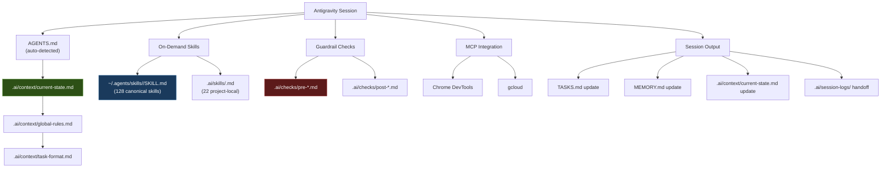

# Antigravity Adapter Setup Guide

## Overview

Google Antigravity automatically reads `AGENTS.md` from the repo root. This
adapter adds dynamic context loading, on-demand skill invocation, and
cross-agent handoff support via the `.ai/` directory structure.

## Quick Setup

```powershell
# From project root — copy adapter files
Copy-Item -Recurse adapters\antigravity\.gemini .gemini -Force

# Verify context files exist
Test-Path .ai\context\current-state.md  # should be True
Test-Path .ai\context\global-rules.md   # should be True
Test-Path .ai\context\task-format.md    # should be True
```

No further setup needed — Antigravity auto-detects `AGENTS.md` and `.gemini/`.

## Context Flow



## Feature Mapping

| multimodel-dev-os | Antigravity Feature | Notes |
|-------------------|-------------------|----|
| `AGENTS.md` | Auto-read at repo root | Primary instructions |
| `MEMORY.md` | Knowledge Items | Persistent project decisions |
| `TASKS.md` | Task artifacts (`task.md`) | Active work tracking |
| `.ai/skills/` | `view_file` on demand | Load only when needed |
| `~/.agents/skills/` | Global skill library | 128 canonical skills |
| `.ai/checks/` | Pre/post execution guards | Safety checklist |
| `.ai/context/` | Dynamic context files | Live state, rules, format |
| `.ai/session-logs/` | Conversation transcripts | Cross-agent handoff |
| `.ai/config.yaml` | Mode switching | Standard vs caveman |
| `.gemini/settings.json` | IDE-level overrides | Exclude patterns, model prefs |

## Token Budget Strategy

The adapter keeps per-turn instruction load under 1,000 tokens by:

1. **Dynamic loading** — context files are read on demand, not embedded
2. **On-demand skills** — only the relevant skill is loaded per phase
3. **Exclude patterns** — `node_modules/`, `dist/`, build artifacts never enter context
4. **Caveman mode** — switch `.ai/config.yaml` mode to `"caveman"` for large codebases

## Cross-Agent Handoff

When handing off to another agent (Claude, Cursor, Codex):

1. Update `.ai/context/current-state.md` with final state
2. Write session log to `.ai/session-logs/YYYY-MM-DD-antigravity.md`
3. Update `TASKS.md` with remaining work
4. Do not assume the next agent reads `.gemini/settings.json`

## Troubleshooting

| Issue | Solution |
|-------|----------|
| Settings not applied | Ensure `.gemini/` is at project root |
| Context missing | Check `.ai/context/` files exist |
| Skills not found | Verify `~/.agents/skills/` is populated |
| Stale state | Re-read `current-state.md` or ask agent to update it |
| Token budget exceeded | Switch to caveman mode in `.ai/config.yaml` |
