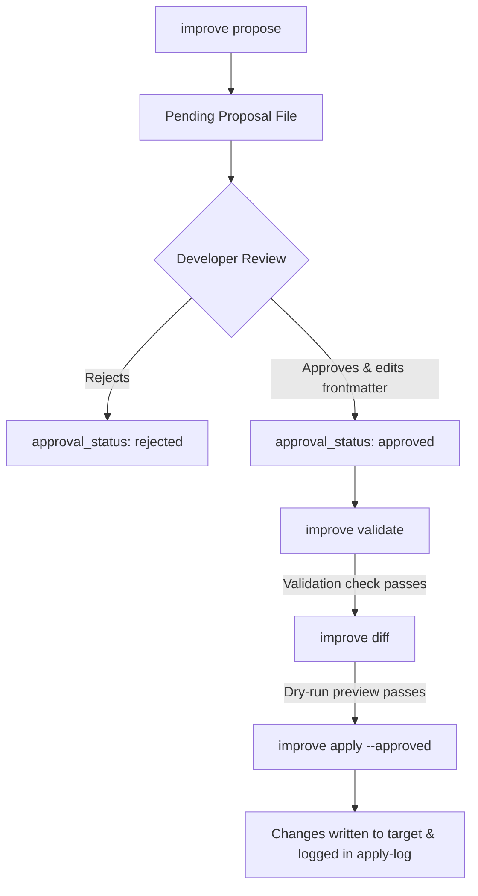

# Approved Proposal Application Engine

MultiModel Dev OS v2.4.1 (Safety & UX Patch) introduces a safe, deterministic, human-approved proposal application layer to automate the execution of approved codebase optimization proposals under strict safety constraints.

---

## 1. Core Workflow

Instead of requiring manual copy-pasting, the CLI can execute machine-applicable operation blocks from proposal files that have been marked as `approved` by a developer.



---

## 2. Machine-Applicable Operations

To automate changes, proposal files support an optional, structured JSON block embedded as a `json` code block in the markdown body:

````markdown
```json
{
  "operations": [
    {
      "type": "create_file",
      "path": "docs/example.md",
      "content": "# Example\n",
      "overwrite": true
    },
    {
      "type": "append_line",
      "path": ".gitignore",
      "line": "node_modules/"
    },
    {
      "type": "replace_text",
      "path": "README.md",
      "find": "old text",
      "replace": "new text",
      "allow_multiple": false
    }
  ]
}
```
````

### Supported Operation Types

| Operation | Parameters | Description |
|---|---|---|
| `create_file` | `path`, `content`, `overwrite` (optional) | Creates a file with the given content. Fails if the file exists unless `overwrite: true`. |
| `append_line` | `path`, `line` | Appends a line to the file. It is idempotent; if the line already exists in the file, it will not be duplicated. |
| `replace_text` | `path`, `find`, `replace`, `allow_multiple` (optional) | Replaces search string `find` with `replace`. Fails if `find` is not found, or matches multiple times unless `allow_multiple: true`. |

### Disallowed Operations for Safety
The following actions are strictly prohibited in the v2.4.0 application engine:
* Deleting or renaming files (`delete_file`, `rename_file`)
* Running arbitrary shell commands
* Installing npm packages or editing package dependencies
* Interacting with Git or version control
* Performing network calls
* Modifying binary files or secret files
* Modifying files outside the target workspace root folder

---

## 3. Strict Safety Gates

The application engine validates every proposal file against a set of strict safety rules before any file is touched:

1. **Existence**: The target proposal markdown file must exist.
2. **Metadata Frontmatter**: YAML frontmatter must parse successfully.
3. **Approval Check**: `approval_status` inside the frontmatter must be explicitly set to `approved`.
4. **CLI Flag**: `improve apply` refuses to execute unless `--approved` is passed by the user.
5. **Operations block**: A valid JSON code block with `operations` array must be found.
6. **Command validation**: Every listed operation type must be allowed.
7. **Directory boundaries**: Every target path must resolve strictly inside the target root directory. Directory traversal using `..` or absolute paths resolves outside target root and fails.
8. **Protected paths**: No protected files or directories (such as `.git/`, `node_modules/`, `.env`, `.npmrc`, SSL keys/certificates) can be written to or modified.
9. **`replace_text` match count**: Search text `find` must match exactly once unless `allow_multiple: true` is passed.
10. **`create_file` overwrites**: If a target file exists, the operation must explicitly specify `overwrite: true`.
11. **`append_line` idempotency**: Line additions will not duplicate if the exact line already exists.
12. **Dry-run diff**: Developers can preview all changes using `improve diff` prior to execution.

---

## 4. CLI Commands

### validate
Validates the proposal frontmatter, safety gates, and operation rules. Displays a color-coded Checklist showing the status of each safety gate (pass, fail, skip) and actionable fixes:
```bash
npx multimodel-dev-os improve validate <proposal-file> --target <path>
```

### diff
Previews the changes grouped by operation type (Create, Append, Replace) in a token-safe truncated format:
```bash
npx multimodel-dev-os improve diff <proposal-file> --target <path>
```

### apply
Deterministically executes the operations listed in the approved proposal file. Refuses to run without the `--approved` flag. Prints pre-apply summaries and detailed idempotent run indicators.
```bash
npx multimodel-dev-os improve apply <proposal-file> --target <path> --approved
```

### log
Lists the history of applied proposals from the audit log:
```bash
npx multimodel-dev-os improve log --target <path>
```

---

## 5. Audit Logging

Every execution of `improve apply` writes an entry to the append-only JSON Lines audit log. Hardened in v2.4.1, it also writes records for failed/refused attempts:
* **Log Location**: `.ai/proposals/apply-log.jsonl`
* **Log Exclusion**: Automatically ignored by Git via `.gitignore` and excluded from AI scanner runs.

Each record conforms to `.ai/intelligence/apply-log.schema.json` and contains:
* `id`: Unique execution identifier (`apply-YYYYMMDD-HHMMSS`)
* `proposal_id`: Proposal file identifier
* `applied_at`: ISO timestamp of execution
* `target`: Resolved workspace target path
* `operations_count`: Total operations performed
* `files_changed`: List of relative paths modified
* `before_hashes`: SHA-256 file hashes before execution
* `after_hashes`: SHA-256 file hashes after execution
* `status`: `success`, `failed`, or `refused`
* `refused_reason`: Reason why validation was refused (when applicable)
* `notes`: Additional run information or failure reasons

---

## 6. Recommended Workflow

To ensure safety, consistency, and clarity, follow this workflow:

1. **validate**: Run `npx multimodel-dev-os improve validate .ai/proposals/proposal-xxxx.md` to run safety gate audits.
2. **diff**: Run `npx multimodel-dev-os improve diff .ai/proposals/proposal-xxxx.md` to review planned changes.
3. **manually review**: Verify the proposal contents, target paths, and operation constraints.
4. **apply**: Run `npx multimodel-dev-os improve apply .ai/proposals/proposal-xxxx.md --approved` to write modifications locally.
5. **run tests**: Manually run verification tests (e.g., `npm run verify` or custom test runner).
6. **commit**: Commit the changes manually to version control.
