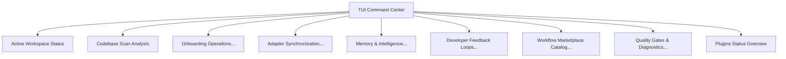

# Interactive TUI Dashboard

MultiModel Dev OS provides an interactive, terminal-based command center to manage all repository operations, adapter syncs, memory builds, proposals, and diagnostics from a single interface.

## Launching the Dashboard

Run either of the following commands to launch the TUI:

```bash
npx multimodel-dev-os@latest dashboard
# or the short alias
npx multimodel-dev-os@latest ui
```

---

## Controls

The dashboard is built using Node.js's native `readline` module. It does not load external UI frameworks or npm prompt dependencies, keeping the execution extremely fast and light.

* **Up / Down Arrows**: Navigate through the menu options.
* **Return (Enter)**: Select and run the highlighted command or enter a submenu.
* **Escape / Ctrl+C**: Exit the dashboard or return to the shell.

---

## Dashboard Structure

The dashboard contains a hierarchical structure mapping to all MMDO CLI actions:



### Main Sections

1. **Active Workspace Status**: Runs the equivalent of `status` to print the current state of packages, active workspace structure, and recommendations.
2. **Codebase Scan Analysis**: Runs the equivalent of `scan` to analyze framework signals and potential token sink risks.
3. **Onboarding Operations**:
   * Analyze Repository (`onboard analyze`)
   * Recommendation Summary (`onboard recommend`)
   * Generate Integration Plan (`onboard plan`)
   * Apply Configs in Dry Run (`onboard apply --dry-run`)
   * View Status Heuristics (`onboard status`)
4. **Adapter Synchronization**:
   * Check Sync Status (`adapter status`)
   * Sync All rule files in Dry Run (`adapter sync all --dry-run`)
   * Diff Cursor Rules (`adapter diff cursor`)
   * Diff Claude Rules (`adapter diff claude`)
5. **Memory & Intelligence**:
   * Memory Build Index (`memory build`)
   * Memory Refresh Changes (`memory refresh`)
   * Memory Diff Index (`memory diff`)
   * Handoff Build Session Summary (`handoff build`)
   * Print Session Summary to Console (`handoff show`)
6. **Developer Feedback Loops & Proposals**:
   * List developer corrections (`feedback list`)
   * Summarize feedback logs (`feedback summarize`)
   * Propose improvement proposal (`improve propose`)
   * Review active proposals list (`improve review`)
7. **Workflow Marketplace Catalog**:
   * Catalog List (`catalog list`)
   * Catalog Recommend (`catalog recommend`)
   * Catalog Status (`catalog status`)
8. **Quality Gates & Diagnostics**:
   * Run Advisory Diagnostics (`doctor`)
   * Strict Schema Compliance (`validate`)
   * Run Release verification tests (`verify`)
9. **Plugins Status Overview**: Checks the status of all installed declarative plugins (`plugin status`).

---

## Zero-Hanging CI Fallback (Non-Interactive Mode)

In automated environments (CI/CD pipelines, GitHub Actions) or when piped, the terminal does not have interactive stdin capabilities. 

To prevent execution from hanging indefinitely, the TUI automatically detects non-TTY environments:
* **Interactive Mode**: Triggered when both `process.stdout.isTTY` and `process.stdin.isTTY` are true.
* **Headless Fallback**: Triggered when run in non-interactive shells, or if `--dry-run` or `--list-actions` is passed. The dashboard immediately prints a structured, grouped list of all menu options along with their corresponding CLI execution strings (including active target flags) and exits cleanly.

Example headless output:

```txt
📊 MultiModel Dev OS Command Center (Headless/CI Preview)
Target Workspace: /workspace
==================================================
  • Active Workspace Status        → npx multimodel-dev-os status
  • Codebase Scan Analysis         → npx multimodel-dev-os scan

  [Onboarding Operations]
    └─ Onboard: Analyze Repository        → npx multimodel-dev-os onboard analyze
    └─ Onboard: Recommendation Summary    → npx multimodel-dev-os onboard recommend
...
```

---

## Safety Controls

1. **No Destructive Operations**: Subcommands that modify files (such as `adapter sync`, `onboard apply`, or `improve apply`) are run in **dry-run** mode by default inside the dashboard menu. 
2. **Bold Command Printing**: Before executing any command from the menu, the dashboard prints the exact command it is running (e.g. `npx multimodel-dev-os memory build`). This ensures that developers can learn the underlying CLI commands and transition to direct CLI operations when scripting.
3. **Subprocess Isolation**: When running subprocess actions, the TUI temporarily detaches keyboard listeners and raw mode, allowing the command to render its output and handle prompts cleanly before restoring TUI control.
