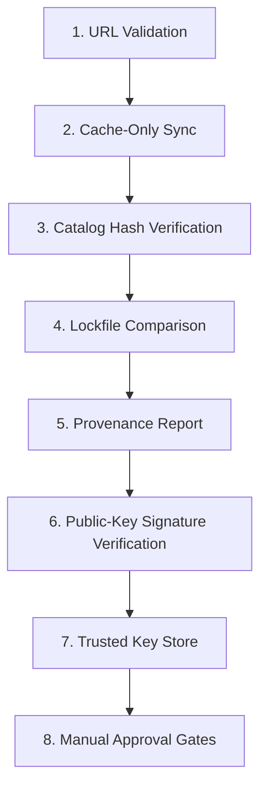

# Registry Security Threat Model

This document outlines the security architecture, threat model using the STRIDE framework, mitigation strategies, and design limitations of the registry and catalog trust systems in MultiModel Dev OS (MMDO).

---

## Gateway Security Scope

v4.2 Gateway Foundation established a localhost mock gateway runtime, dry-run routing, resilience simulation, preview-only client plans, and bounded observability.

v4.3 Sprint A extends this baseline by defining formal **Execution Contracts and Threat Boundaries** (`src/gateway/contracts/execution-request.js`, `execution-result.js`, `credential-ref.js`, `provider-endpoint.js`). Outbound execution remains contract-only in Sprint A: no network sockets are opened, credentials are not read from the environment, and provider HTTP calls do not execute.

The key gateway boundaries and threat controls are:

- **Localhost & Loopback Defaults**: Binding remains `127.0.0.1` by default.
- **Strict HTTPS Enforcement**: Provider endpoints must use `https://`. Insecure `http://` endpoints are rejected.
- **SSRF Mitigation**: Private IP addresses (RFC 1918, loopback, link-local) and embedded credentials in URLs are rejected by contract validators.
- **Zero Redirect Policy**: `follow_redirects` is hardcoded to `false` for provider endpoints.
- **Environment Credential References**: Credentials reference environment variable names (`credential_ref.env_var`) only. Raw secret values in contract objects trigger validation errors.
- **Mandatory Redaction**: Execution results require `redacted: true`.
- **Zero Runtime Dependencies**: All validators rely strictly on Node.js standard library and native gateway protocol primitives.

---

## 1. Threat Scenarios & Mitigations

### Threat: Attacker Modifies Remote Registry Manifest
- **Description**: An attacker compromises the remote host or storage bucket containing the registry manifest file (`manifest.json`) and attempts to alter its contents.
- **Mitigation**: 
  - Every sync operation retrieves the manifest. 
  - The client verifies the manifest's cryptographic signature against the local trust store ([`trusted-keys.yaml`](../.ai/registries/trusted-keys.yaml)). 
  - If the manifest's contents are modified by an attacker, the signature verification check fails, halting verification and refusing cache sync.

### Threat: Attacker Modifies Catalog Contents
- **Description**: An attacker alters the `catalog.yaml` index to point to malicious plugins or scripts, while leaving the manifest file unchanged.
- **Mitigation**: 
  - The `manifest.json` contains a SHA-256 integrity hash of `catalog.yaml` (`catalog_hash`). 
  - The client calculates the local SHA-256 hash of the downloaded `catalog.yaml` and asserts it matches the manifest's `catalog_hash`. Any discrepancy halts synchronization.

### Threat: Attacker Compromises Transport (Man-in-the-Middle)
- **Description**: An attacker intercepts the network connection to spoof registry manifests or download files.
- **Mitigation**: 
  - Registry URLs are strictly validated to require secure HTTPS connections. HTTP is rejected by default.
  - Transport integrity is backed by public-key Ed25519 signatures. Even if transport-level security is compromised, the client asserts the signature matches a trusted key.

### Threat: Attacker Submits Malicious Plugin Metadata
- **Description**: An attacker registers a plugin with malicious parameters, such as directory paths designed to cause directory traversal, or shell scripts designed to run command injection.
- **Mitigation**: 
  - Strict path safety validation is performed on plugin installation paths to prevent path traversal outside permitted `.ai/` and `adapters/` directories.
  - Slugs are validated against strict alphanumeric patterns (`/^[a-z0-9-_]+$/i`).
  - Catalog synchronization is cache-only and non-executing. Synchronizing remote registries does not run any code or auto-install plugins.

### Threat: Path Traversal
- **Description**: An attacker crafts registry source configurations or manifest files using relative directory sequences (e.g. `../../etc/passwd`) to read or write sensitive files.
- **Mitigation**: 
  - All file path resolutions are strictly bounded and verified using canonical paths (`path.resolve`). Access outside the approved workspace directory is rejected.

### Threat: Command Injection via Registry URLs
- **Description**: An attacker specifies registry URLs containing shell metacharacters (e.g., quotes, backticks, semicolons) hoping to execute shell commands during sync or fetch operations.
- **Mitigation**: 
  - The fetch helper utilizes `execFileSync` instead of shell-based `execSync`, ensuring URL values are treated strictly as literal command arguments.
  - Strict validation rejects URLs containing whitespace or shell command syntax.

### Threat: Stale/Replay Registry Data
- **Description**: An attacker serves a valid, signed registry manifest from the past (e.g. version 1.0.0 containing an older, vulnerable plugin) to roll back updates.
- **Mitigation**: 
  - The local lockfile (`` `registry-lock.json` ``) records the last synchronized manifest hash, version, and sync timestamp. 
  - Replays or attempts to downgrade manifest versions can be detected via local history comparison.

### Threat: Unknown/Revoked Signing Keys
- **Description**: An attacker signs a malicious manifest using an expired, disabled, revoked, or unconfigured signing key.
- **Mitigation**: 
  - Key IDs are verified against active trust store records. If a key is marked `revoked` or `disabled`, verification immediately fails.
  - Keys lacking the specific `scopes: ["registry"]` or `scopes: ["catalog"]` attribute are rejected.

### Threat: Local Cache Tampering
- **Description**: An attacker with local access modifies the cache files in `.ai/registry-cache/` to bypass remote verification.
- **Mitigation**: 
  - Every `registry verify` run calculates the SHA-256 hashes of all cached files and compares them against the tamper-evident local provenance lockfile (`registry-lock.json`), which is committed to VCS.

---

## 2. Trust Model Layers

MultiModel Dev OS enforces a multi-layer defense-in-depth model:

1. **URL Validation**: Rejects non-HTTPS, command-injection characters, or malformed URLs.
2. **Cache-Only Sync**: Downloads files strictly to offline cache folders. No script execution occurs.
3. **Catalog Hash Verification**: Asserts SHA-256 integrity matches between files and manifest list.
4. **Lockfile Comparison**: Checks current downloaded hashes against committed VCS registry lockfile.
5. **Provenance Report**: Computes local and signature status to output detailed trust verdicts.
6. **Public-Key Signature Verification**: Verifies cryptographic signatures using Ed25519.
7. **Trusted Key Store**: Verifies that the signing key is configured, active, and scoped.
8. **Manual Approval Gates**: Plugin installation requires explicit `--approved` confirmation from the operator.

---

## 3. Limits & Constraints

- **Local HMAC Mode Limitations**: HMAC signature mode provides project-scoped integrity verification (proving a registry was synced by a project member with the key). It does *not* prove remote publisher identity to the public.
- **Asymmetric Signature Boundaries**: Ed25519 signatures verify publisher identity only if the user's local trust store is correct. If the trust store itself is compromised or loaded with untrusted public keys, signatures cannot prevent spoofing.
- **HTTPS Limitations**: HTTPS secures transit integrity against network-level eavesdroppers. It does not establish publisher identity or code quality.
- **Operator Overrides**: No security model can protect users who manually execute command overrides (`--approved` or `--force`) without inspecting the manifest and plugins being installed.
