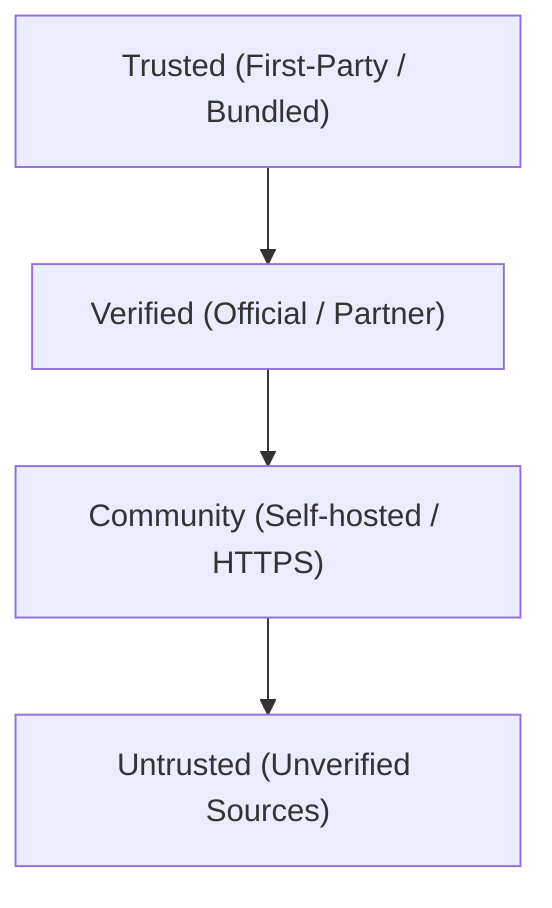

# Trusted Registries & Provenance

MultiModel Dev OS uses a structured trust model to verify the origin and integrity of third-party plugins before they are permitted to run workflows or write configurations.

## The Trust Hierarchy

Every registry source defined in `.ai/registries/sources.yaml` is assigned a `trust_level`. This level controls whether plugins from that registry are allowed to install and what security policies apply.



### 1. Trusted
* **Source:** Local filesystem, bundled directly in the npm package.
* **Verification:** Built-in verification suites.
* **Safety:** Sandboxed, pre-validated declarative configs.
* **Installation:** Approved by default.

### 2. Verified
* **Source:** Official MultiModel Dev OS registries or verified enterprise partners.
* **Verification:** Signed manifests and SHA256 checksum chains.
* **Safety:** Reviewed schemas with strict write directories.
* **Installation:** Installs cleanly if remote registries are allowed in policy.

### 3. Community
* **Source:** User-added HTTPS endpoints or public git repositories.
* **Verification:** Basic SHA256 checksum verification.
* **Safety:** Sandboxed logic, restricted file paths.
* **Installation:** Refused unless `allow_untrusted_install: true` is configured in `.ai/policies/registry-policy.yaml`.

> [!IMPORTANT]
> **HTTPS Transport Enforcement (v3.0.2+)**
> All remote community or verified registries must use secure `https:` transport URLs. URLs are validated strictly against injection risks. Unencrypted `http:` transport is strictly rejected, except for localhost testing if `allow_http_localhost` is enabled.

### 4. Untrusted
* **Source:** Unknown or flagged endpoints.
* **Verification:** None.
* **Safety:** High risk.
* **Installation:** Blocked in all standard configurations.

---

## Provenance Verification Mechanism

To guarantee that remote catalogs have not been tampered with in transit, the registry sync system enforces a cryptographic verification chain.

```
[Registry Provider]                      [Local Client]
  catalog.yaml    ---(SHA256 Hash)--->  manifest.json
  manifest.json   ---(Signature)----->  registry verify
```

1. **Manifest File (`manifest.json`):** Every verified remote registry publishes a manifest file containing a map of all relative files in the catalog and their expected SHA256 checksums.
2. **SHA256 Verification:** During `registry sync`, the client downloads the manifest and computes the SHA256 hash of all retrieved assets.
3. **Local Audit:** The computed hashes are written to `checksums.json` in the cache directory.
4. **Signature Verification (v3.5.0)**: The `signature` object or `signatures` array in the manifest is cryptographically verified using Ed25519 public-key signature verification against keys registered in the trust store (`.ai/registries/trusted-keys.yaml`).

---

## Integrity Check Command

To manually audit the cache integrity and check if any files have been modified or corrupted, run the `registry verify` command:

```bash
npx multimodel-dev-os registry verify partner-registry
```

Example Output:
```
🔍 Verifying Registry: partner-registry
==================================================
  ✓ catalog.yaml: VERIFIED
  ✓ manifest.json: VERIFIED
  ✓ catalog/nextjs-workflows.yaml: VERIFIED
  ✓ catalog/.ai/skills/nextjs-builder.md: VERIFIED

✔ Registry 'partner-registry' verification passed.
```
