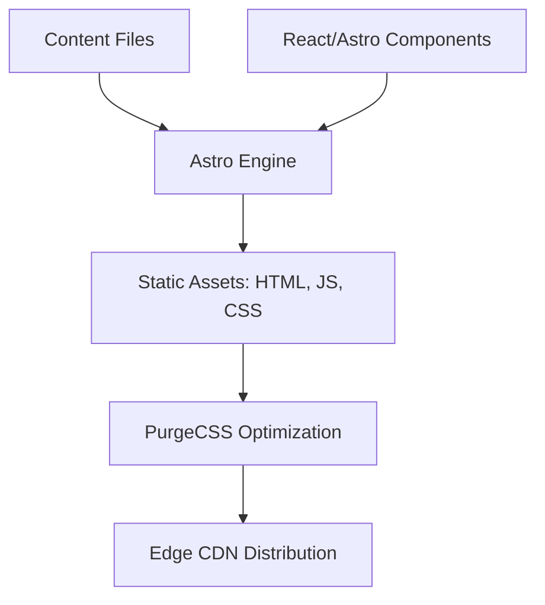

# Architecture Map

```mermaid
graph TD
  Markdown[Content Files] --> Astro[Astro Engine]
  Components[React/Astro Components] --> Astro
  Astro --> Static[Static Assets: HTML, JS, CSS]
  Static --> Purge[PurgeCSS Optimization]
  Purge --> CDN[Edge CDN Distribution]
```

Static sites are distributed strictly through static hosting with zero server overhead.